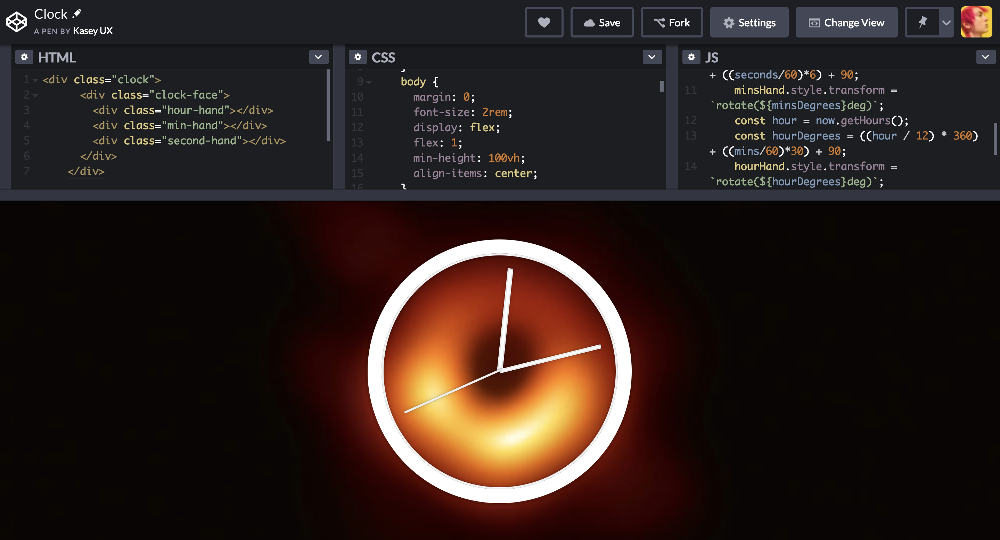

## Day 1
### [v a p o r w a v e . m i x e r](https://s.codepen.io/bitpixi/debug/bJwoEM/YvMgOnQaPNvM)

I changed the drum kit project to a "vaporwave mixer" with related content, changed the key-data from letters to numerics, and altered some of the styles. First I uploaded this to Code.Pen, but it was blocking 3rd party .wav and .gif content, so I decided to move the project to Github and upload the .wav and .gif files to a local folder here. Then the JS wasn't running, so I spent some time debugging and setting up Github Pages. 

## Day 2
### [Messier 87 Black Hole Clock](https://codepen.io/bitpixi/pen/VNrdOx)

I fixed the "rewind" bug by shortening the CSS transition time. I also changed the clock hands to thicker and thinner levels to differentiate between hours, minutes, and seconds. Then I changed the hands to match the circle by replicating the white with bezzle style in moderately proportional ratios. Finally, I added a background from topical meme culture about the M87 Black Hole to create a contrasting background.

## Day 3
### [CSS Variables + JS](https://codepen.io/bitpixi/pen/MRPbXb)

I learned how to create the new CSS variables that change on the page with JS. Then I chose a new image, background color, font size, base-base color, removed the large title, and re-arranged the location of the sliders so that they would have more breathing room in between each other. The image I chose was one that would have more meaning for the "blur" effect - a woman being more or less "exposed" to the viewer. 
